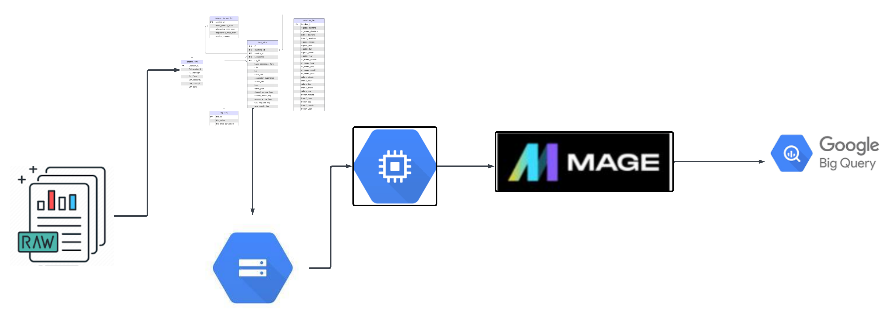
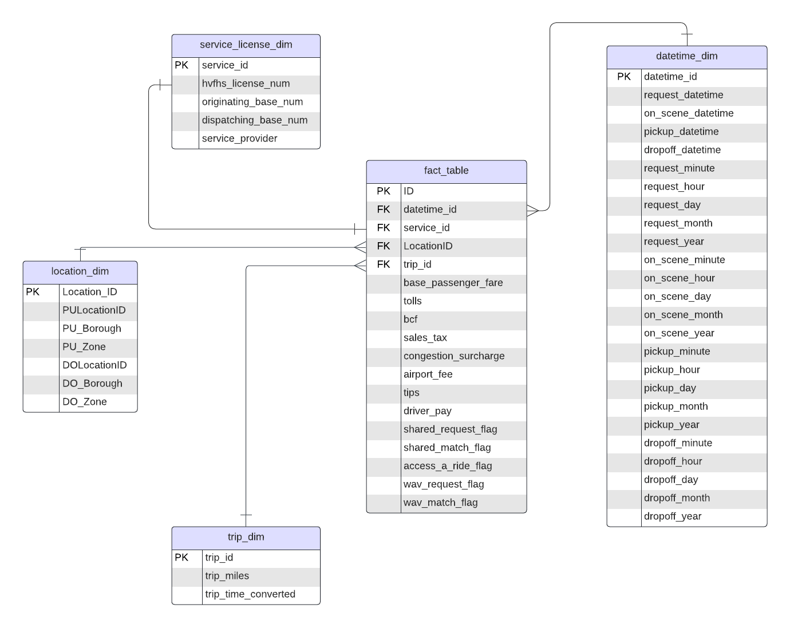

# NYC TLC Data Engineering ETL Project 

## Introduction

The goal of this project is to perform ETL on NYC TLC Trip data using various tools and technologies, including GCP Storage, Python, Compute Instance, Mage Data Pipeline Tool, and BigQuery.

## Architecture 

## Technology Used
- Programming Language - Python

Google Cloud Platform
1. Google Storage
2. Compute Instance 
3. BigQuery

## Data Model

Modern Data Pipeine Tool - https://www.mage.ai/

Contibute to this open source project - https://github.com/mage-ai/mage-ai

## Dataset Used
TLC Trip Record Data
Yellow and green taxi trip records include fields capturing pick-up and drop-off dates/times, pick-up and drop-off locations, trip distances, itemized fares, rate types, payment types, and driver-reported passenger counts.
fhvhv_trip_data_2023-12.parquet - https://www.nyc.gov/site/tlc/about/tlc-trip-record-data.page
taxi_zone_lookup_table.csv - https://www.nyc.gov/site/tlc/about/tlc-trip-record-data.page
Data Dictionary - https://www.nyc.gov/assets/tlc/downloads/pdf/data_dictionary_trip_records_hvfhs.pdf
